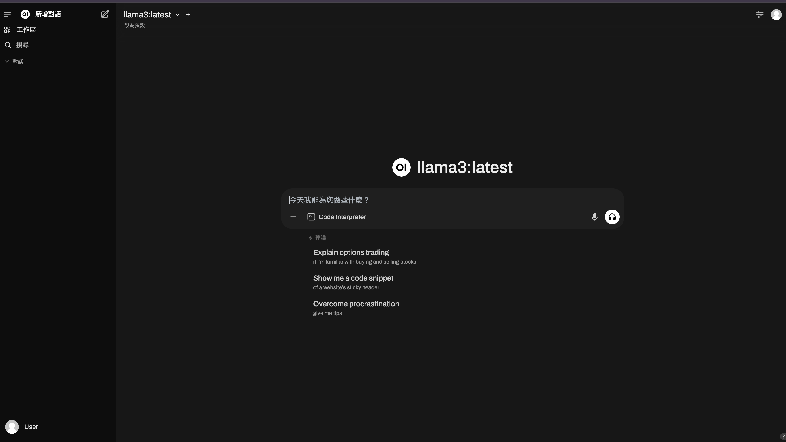

# Ollama Implement

這是一個 Ollama 實作練習的專案，旨在學習如何使用 Docker 和 Docker Compose 部署 Ollama 模型服務。

## 目標

本專案使用 Docker Compose 來部署 Ollama 的容器，並提供簡單的配置，幫助開發者在自己的環境中運行 Ollama 服務。

### 使用Open WebUI來推論本地ollama模型



## 啟動服務

```bash
docker-compose up -d
```

## 檢查服務是否運行正常

```bash
curl http://localhost:11434
```

## 停止服務

```bash
docker-compose down
```

## ollama模型清單

# 常見的 Ollama 模型列表

## 🔥 通用大型語言模型（LLM）
| 模型名稱        | 參數規模 | 大小  | 說明 |
|---------------|---------|------|------|
| **Llama 3**   | 8B / 70B | 4.7GB / 40GB | Meta 最新開源模型，適用於各種應用。 |
| **Mistral**   | 7B | 4.1GB | 高效能開源模型，擅長生成與推理。 |
| **Qwen**      | 7B / 14B | 4.5GB / 8.9GB | 阿里巴巴開源模型，優化中文處理能力。 |
| **Solar**     | 10.7B | 6.1GB | 高效能模型，適用於多領域應用。 |
| **Phi-2**     | 2.7B | 1.7GB | 微軟開發的小型但高效的 LLM。 |
| **Orca Mini** | 3B | 1.9GB | 較小型的模型，適合資源有限環境。 |
| **Starling**  | 7B | 4.1GB | 高效開源 LLM，適用於日常對話。 |

---

## 💻 程式碼專用模型
| 模型名稱        | 參數規模 | 大小  | 說明 |
|---------------|---------|------|------|
| **Code Llama** | 7B | 3.8GB | Meta 開發的程式碼生成與理解模型。 |

---

## 🗣️ 專注對話與聊天
| 模型名稱        | 參數規模 | 大小  | 說明 |
|---------------|---------|------|------|
| **Neural Chat** | 7B | 4.1GB | 最適合對話應用的開源 AI 模型。 |
| **Dolphin Phi** | 2.7B | 1.6GB | 強調高效推理與對話能力。 |

---

## 📷 多模態（語音、圖像+文本）
| 模型名稱        | 參數規模 | 大小  | 說明 |
|---------------|---------|------|------|
| **LLaVA** | 7B | 4.5GB | 支援圖像與文本理解的多模態模型。 |

---

## 📌 下載指令範例
```bash
ollama pull llama3
ollama pull mistral
ollama pull phi:2
ollama pull code-llama
ollama pull qwen
```

## 執行模型
```bash
ollama run llama3:latest
```

## 參考文章
[Ollama 在本機環境輕鬆執行 LLM 及其延伸應用](https://reurl.cc/xpbpAE)

